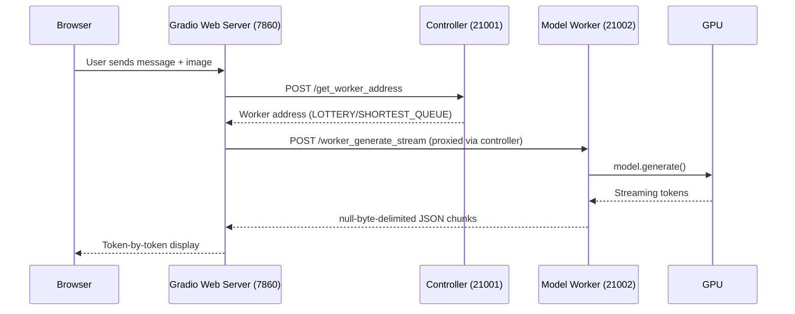
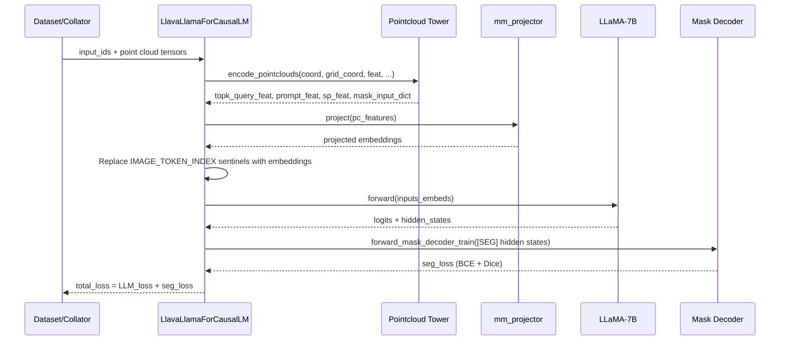
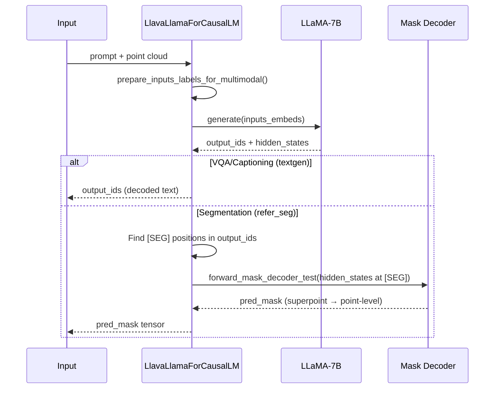

# Codebase Map

> Auto-generated by Cartographer. Last mapped: 2026-05-12T08:20:48Z

## System Overview

3D-LLaVA (CVPR 2025) is a 3D Large Multimodal Model that processes 3D point clouds and text to perform Visual Question Answering, Dense Captioning, and 3D Referring Segmentation. It extends LLaVA-v1.5-7b with an Omni Superpoint Transformer (OST) backbone for 3D point cloud understanding.

```mermaid
graph TB
    subgraph Input
        PC[Point Cloud]
        TXT[Text Instruction]
    end
    subgraph "3D Encoder Pipeline"
        SPConv["SpConv U-Net<br/>(sparse 3D convolutions)"]
        OST["OST Decoder<br/>(distance-biased self-attention)"]
        VS["Visual Sampler<br/>(frozen, prompt features)"]
    end
    subgraph "Language Model"
        Proj["mm_projector<br/>(MLP, shared)"]
        LLM["LLaMA-7B<br/>(with LoRA)"]
        SEG["[SEG] token head<br/>(segmentation output)"]
    end
    subgraph "Task Heads"
        MD["Mask Decoder<br/>(trainable)"]
        VQA["Text generation<br/>(VQA / Captioning)"]
    end

    PC --> SPConv --> OST
    OST -->|topk features| Proj
    OST -->|hidden states| VS
    OST -->|superpoint feats| MD
    TXT --> LLM
    Proj -->|projected embeddings| LLM
    LLM -->|text output| VQA
    LLM -->|[SEG] hidden states| SEG
    SEG --> MD
```

## Directory Structure

```
3D-LLaVA/
├── llava/                          # Main package
│   ├── model/                      # Model architecture
│   │   ├── llava_arch.py           # Core: multimodal mixin (encoders, projector, token insertion)
│   │   ├── builder.py              # Model loading (full, LoRA, projector-only)
│   │   ├── language_model/
│   │   │   └── llava_llama.py      # LlavaLlamaForCausalLM (main model class)
│   │   ├── multimodal_encoder/     # 3D point cloud + 2D image encoders
│   │   │   ├── pointcloud_encoder.py   # SPConvPointCloudTower (top-level 3D pipeline)
│   │   │   ├── clip_encoder.py         # CLIP vision tower (frozen)
│   │   │   ├── spconv_unet.py          # Sparse 3D U-Net backbone
│   │   │   ├── prompt_encoder.py       # Instance prompt MLP
│   │   │   ├── ost_module/             # Omni Superpoint Transformer
│   │   │   ├── custom_spconv_module/   # Mixed-precision sparse conv layers
│   │   │   └── configs/                # Model config (ScanNet200)
│   │   └── multimodal_projector/
│   │       └── builder.py          # MLP projector (shared for image + point cloud)
│   ├── train/                      # Training infrastructure
│   │   ├── train.py                # Main training script (13 sections)
│   │   ├── train_mem.py            # Flash attention wrapper
│   │   ├── llava_trainer.py        # Custom trainer (multi-LR, task-aware sampling)
│   │   └── *_monkey_patch.py       # Flash attention / xFormers patches
│   ├── eval/                       # Evaluation scripts (5 benchmarks)
│   │   ├── model_scanqa.py         # ScanQA inference
│   │   ├── model_sqa3d.py          # SQA3D inference
│   │   ├── model_scanrefer.py      # ScanRefer segmentation inference
│   │   ├── model_multi3drefer.py   # Multi3DRefer segmentation inference
│   │   ├── model_scan2cap.py       # Scan2Cap dense captioning inference
│   │   └── eval_*.py               # Metric computation scripts
│   ├── pc_utils/                   # Point cloud transform library
│   │   ├── transform.py            # 45+ registered transforms (Compose pipeline)
│   │   ├── default.py              # Pre-defined transform pipelines per task
│   │   └── registry.py             # OpenMMLab-style registry system
│   ├── serve/                      # Distributed serving (controller + workers)
│   ├── constants.py                # Special token indices and magic values
│   ├── conversation.py             # Chat templates (vicuna, llama-2, mpt, mistral)
│   └── mm_utils.py                 # Tokenizer with special tokens, image processing
├── libs/                           # CUDA extension libraries
│   ├── pointops/                   # General point cloud ops (query, sample, group, etc.)
│   └── pointgroup_ops/             # Instance segmentation ops (voxelize, BFS cluster)
├── scripts/
│   ├── train/                      # Training shell scripts (LoRA finetune)
│   └── eval/                       # Multi-GPU evaluation shell scripts
└── docs/                           # Documentation
```

## Module Guide

### Core Model Architecture

**Purpose**: Defines how 3D point cloud encoders connect to the LLaMA language model via a shared projector.
**Entry point**: `llava/model/language_model/llava_llama.py` -> `LlavaLlamaForCausalLM`

| File | Purpose | Tokens |
|------|---------|--------|
| `llava/model/llava_arch.py` | Multimodal mixin: encoder setup, token embedding insertion, segmentation flow | 4994 |
| `llava/model/language_model/llava_llama.py` | Concrete model class with forward, generate, mask decoder | 3224 |
| `llava/model/builder.py` | Model loading (full/LoRA/projector-only, quantization support) | 2240 |
| `llava/model/multimodal_projector/builder.py` | MLP projector factory (linear/mlp2x_gelu/identity) | 334 |
| `llava/constants.py` | Special token indices (`IMAGE_TOKEN_INDEX=-200`, `LINK_TOKEN_INDEX=-300`, etc.) | 119 |
| `llava/mm_utils.py` | Tokenizer with `<image>`, `<link>`, `<loc>` special token handling | 2366 |

**Exports**: `LlavaLlamaForCausalLM`, `LlavaConfig`
**Dependencies**: transformers (LlamaForCausalLM), PEFT (LoRA), bitsandbytes (quantization)

**Inheritance hierarchy**:
```
LlavaLlamaForCausalLM(LlamaForCausalLM, LlavaMetaForCausalLM)
  └── self.model = LlavaLlamaModel(LlamaModel, LlavaMetaModel)
       ├── vision_tower (CLIPVisionTower, frozen)
       ├── pointcloud_tower (SPConvPointCloudTower)
       ├── mm_projector (shared MLP)
       ├── inst_prompt_encoder (InstPromptEncoder)
       └── mask_decoder + hidden_seg_fc (segmentation)
```

### 3D Point Cloud Encoder

**Purpose**: Encodes 3D point clouds into features for the LLM using sparse convolutions and transformer attention.
**Entry point**: `llava/model/multimodal_encoder/pointcloud_encoder.py` -> `SPConvPointCloudTower`

| File | Purpose | Tokens |
|------|---------|--------|
| `pointcloud_encoder.py` | Top-level 3D pipeline: segmentor + visual sampler + mask decoder | 1115 |
| `spconv_unet.py` | 5-level sparse 3D U-Net backbone (32->64->96->128->160 channels) | 1588 |
| `ost_module/omni_superpoint_transformer.py` | Main OST model: voxelization -> U-Net -> superpoint aggregation -> decoder | 3529 |
| `ost_module/sa_only_decoder.py` | Transformer decoders with distance-biased self-attention | 6955 |
| `ost_module/refer_seg_criterion.py` | Segmentation loss (BCE + Dice) with sparse topk matching | 4124 |
| `ost_module/inst_seg_criterion.py` | Full instance segmentation criterion with Hungarian matching | 7987 |
| `ost_module/mask_matrix_nms.py` | Matrix NMS for multi-class instance masks | 1138 |
| `custom_spconv_module/spconv_layers.py` | Mixed-precision sparse conv (forces float32 for AMP stability) | 10137 |
| `configs/ost-sa-only-llava-align-scannet200.py` | ScanNet200 config (200 semantic, 198 instance classes) | 632 |

**3D Encoding Pipeline**:
```
Raw Points (coord + color, 6ch)
  → SubMConv3d (6 → 32ch)
  → SpConvUNet (5 levels, multi-scale voxel features)
  → Scatter mean (voxel → point → superpoint aggregation)
  → Position encoding (3D coords → 32ch)
  → ScanNetQueryDecoder_SA_Only_Dist_Bias (3 layers, distance-biased self-attention)
  → alignment_proj (256ch → 1024ch to LLM dim)
  → top-K query selection by classification confidence
```

### CUDA Extension Libraries

**Purpose**: High-performance GPU operations for point cloud processing.

| Library | Key Operations | Build Name |
|---------|---------------|------------|
| `libs/pointops/` | KNN query, ball query, FPS, grouping, interpolation, aggregation, subtraction, attention | `pointops._C` |
| `libs/pointgroup_ops/` | Voxelization (idx/fp/bp), ball query batch, BFS clustering | `pointgroup_ops_cuda` |

**Pattern**: `C++/CUDA kernel → pybind11 → torch.autograd.Function → .apply() → package __init__.py`
**Requirements**: PyTorch with CUDA, CUDA toolkit, GCC. Both require `python setup.py install`.

### Training

**Purpose**: Full training pipeline with DeepSpeed, LoRA, task-aware sampling, and per-module learning rates.
**Entry point**: `llava/train/train_mem.py` (calls `train(attn_implementation="flash_attention_2")`)

| File | Purpose | Tokens |
|------|---------|--------|
| `train/train.py` | 13-section training pipeline (args, model, data, training loop, saving) | 14096 |
| `train/llava_trainer.py` | Custom Trainer: DeepSpeed zero-3, 4 sampling strategies, 5 LR groups | 5209 |
| `train/train_mem.py` | Thin wrapper enabling flash attention 2 | 28 |

**Key training features**:
- 5 independent learning rates: base, mm_projector, pc_projector, pointcloud_tower, pointcloud_decoder
- 4 sampling strategies: task_ratio, task_length_per_batch, task_length, modality_length
- 3 task types: VQA (0), dense_captioning (1), refer_seg (2) with default ratio 0.3/0.3/0.4
- DeepSpeed zero-3 with external parameter registration for pointcloud modules
- LoRA with auto-discovered target modules (excludes multimodal keywords)
- Pointcloud tower is always frozen (`assert freeze_pointcloud_tower`); only whitelisted modules stay trainable

### Evaluation

**Purpose**: Inference and scoring for 5 3D scene understanding benchmarks.

| Benchmark | Inference | Scoring | Output | Metrics |
|-----------|-----------|---------|--------|---------|
| ScanQA | `model_scanqa.py` | `eval_scanqa.py` | Text | EM1, Bleu(1-4), METEOR, ROUGE_L, CIDEr, SPICE |
| SQA3D | `model_sqa3d.py` | `eval_sqa3d.py` | Text | EM1 per type (0-5) |
| Scan2Cap | `model_scan2cap.py` | `eval_scan2cap.py` | Text | Bleu(1-4), METEOR, ROUGE_L, CIDEr @ IoU 0.25/0.50 |
| ScanRefer | `model_scanrefer.py` | `eval_refer_seg.py` | Mask | mIoU, Acc@0.25, Acc@0.50 |
| Multi3DRefer | `model_multi3drefer.py` | `eval_refer_seg.py` | Mask | mIoU, Acc@0.25, Acc@0.50 |

**Evaluation flow**: Multi-GPU inference (chunk-based) → merge JSONL → compute metrics.

### Point Cloud Transforms

**Purpose**: Configurable transform pipelines for 3D point cloud preprocessing.
**Entry point**: `llava/pc_utils/transform.py` -> `Compose`, `TRANSFORMS` registry

| File | Purpose | Tokens |
|------|---------|--------|
| `pc_utils/transform.py` | 45+ registered transforms (geometric, voxel, color, superpoint, instance) | 24055 |
| `pc_utils/default.py` | 6 pre-defined pipelines (3 train + 3 eval) | 1288 |
| `pc_utils/registry.py` | OpenMMLab-style Registry pattern | 2372 |

**Transform pipeline per task**:
- **VQA train**: SceneAlignment → CenterShift → RandomDropout → GlobalRotScaleTrans → VoxelizationInfo → CenterShift → NormalizeColor → ShufflePoint → GetContinualSuperpointMask → condition="vqa"
- **ReferSeg train**: Same as VQA + RandomFlip + ElasticDistortion + AddReferTarget → condition="refer_seg"
- **DenseCap train**: SceneAlignment → Refer2InstanceMask → ... → Mask2Box → condition="dense_captioning"
- **All eval**: Minimal pipeline (no augmentation), condition="textgen" or "refer_seg"

### Serving

**Purpose**: Distributed inference with controller-worker architecture.



## Data Flow

### Training Forward Pass



### Inference Generation



## Conventions

- **Registry pattern**: Custom `Registry` class (from mmcv/OpenMMLab) used for models, losses, transforms, and task utilities. Classes self-register via `@REGISTRY.register_module()`.
- **Mixin architecture**: `LlavaMetaModel` and `LlavaMetaForCausalLM` are mixins that add multimodal capabilities to any HuggingFace causal LM backbone.
- **Factory functions**: Builders in `builder.py` files construct encoders, projectors, and models from config objects.
- **Sentinel tokens**: `IMAGE_TOKEN_INDEX=-200` for both `<image>` and `<pc>`, `LINK_TOKEN_INDEX=-300` for `<link>`, `LOC_TOKEN_INDEX=-400` for click prompts.
- **Transform pipelines**: Declarative config-driven transform chains via `Compose`. Each task has separate train/eval pipelines.
- **CUDA extensions**: C++/CUDA kernels wrapped in `torch.autograd.Function` with `.apply()` pattern. Built via `setup.py install`.
- **DeepSpeed zero-3**: External parameter registration required for pointcloud tower/decoder modules.

## Gotchas

- **`IMAGE_TOKEN_INDEX` reuse**: The `<pc>` token uses the same sentinel `-200` as `<image>`, not a separate index. This is explicitly documented in `llava_arch.py` comments.
- **Frozen pointcloud tower**: Training asserts `freeze_pointcloud_tower=True`. Only whitelisted modules (`alignment_proj`, `hidden_seg_fc`) stay trainable.
- **Shared projector**: `mm_projector` is shared between image and point cloud features. When both `mm_vision_tower` and `mm_pointcloud_tower` configs exist, the point cloud tower overwrites the projector.
- **Leftover debug code**: `pdb.set_trace()` in `omni_superpoint_transformer.py` line ~259 will halt execution if `predict_top_queries` is called.
- **Missing import**: `Mapping` is referenced but not imported in all model eval scripts (potential NameError).
- **vocab_size mismatch**: For LoRA checkpoints, `builder.py` adjusts vocab_size from 32001 to 32000 and back, related to the `[SEG]` token.
- **`lm_head` slicing**: The segmentation token gets a separate `lm_head_seg` head; `lm_head` outputs `[..., :-1]` logits then concatenates with `lm_head_seg` output.
- **Batch size 1 for segmentation**: `generate()` asserts `output_ids.shape[0] == 1` during segmentation inference.
- **Hardcoded `scannet_axis_align_file`**: Path is hardcoded in `pc_utils/default.py`. Must exist for VQA/SQA3D/Scan2Cap transforms.
- **Duplicate `SPConvPointCloudTower` import**: In `multimodal_encoder/builder.py`, imported twice (lines 3 and 5).
- **Config property bugs**: `pointcloud_encoder.py` references `self.vision_tower` and `self.unet` which don't exist on `SPConvPointCloudTower`.

## Navigation Guide

**To add a new evaluation benchmark**: Create `model_<benchmark>.py` in `llava/eval/` (copy `model_scanqa.py` as template), create `eval_<benchmark>.py` for metrics, add a shell script in `scripts/eval/`.

**To add a new point cloud transform**: Register it in `llava/pc_utils/transform.py` with `@TRANSFORMS.register_module()`, add it to a pipeline in `llava/pc_utils/default.py`.

**To modify the 3D encoder architecture**: Edit `llava/model/multimodal_encoder/ost_module/sa_only_decoder.py` (decoder layers), `spconv_unet.py` (backbone), or `omni_superpoint_transformer.py` (full pipeline).

**To change the segmentation loss**: Edit `llava/model/multimodal_encoder/ost_module/refer_seg_criterion.py` or `inst_seg_criterion.py`.

**To add a new task type**: Add task ID in training data JSON, create transform pipeline in `default.py`, update `LazySupervisedDataset` in `train.py`, update `LlavaLlamaForCausalLM.generate()` to handle new condition.

**To modify training hyperparameters**: Edit `scripts/train/finetune-3d-llava-lora.sh` (shell args) or `TrainingArguments` dataclass in `train/train.py`.

**To change model loading**: Edit `llava/model/builder.py` (`load_pretrained_model`).
